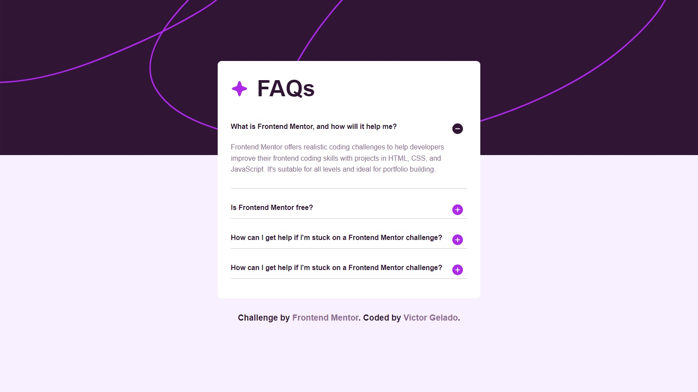

# Frontend Mentor - FAQ accordion solution

This is a solution to the [FAQ accordion challenge on Frontend Mentor](https://www.frontendmentor.io/challenges/faq-accordion-wyfFdeBwBz). Frontend Mentor challenges help you improve your coding skills by building realistic projects. 

## Table of contents

- [Overview](#overview)
  - [The challenge](#the-challenge)
  - [Screenshot](#screenshot)
  - [Links](#links)
- [My process](#my-process)
  - [Built with](#built-with)
- [Author](#author)

## Overview

### The challenge

Users should be able to:

- Hide/Show the answer to a question when the question is clicked
- Navigate the questions and hide/show answers using keyboard navigation alone
- View the optimal layout for the interface depending on their device's screen size
- See hover and focus states for all interactive elements on the page

### Screenshot



### Links
- Live Site URL: [Live site url](https://your-live-site-url.com](https://faq-accordion-victor.netlify.app/)

## My Process

### Built with

- CSS custom properties
- Flexbox
- [React](https://reactjs.org/) - JS library
- [Styled Components](https://styled-components.com/) - For styles
- [React faq component](https://www.npmjs.com/package/react-faq-component) - For faq

### Run Project

Clone this repository on your machine and open it in your preferred IDE.

```bash
git clone https://github.com/VictorGelado/FrontEndMentorReact/
```

Run the commands to install dependencies and run the project.

```bash
npm install
```

```bash
npm start
```

If you don't have **npm**: [how to install **npm**](https://www.npmjs.com/package/npm).

## Author

Made by **VictorGelado**

<div>
  <a href="https://www.instagram.com/victorgelado_dev/" target="_blank"></a>
  <a href="https://www.linkedin.com/in/victorgelado/" target="_blank"/></a>
  <a href="mailto:victorgeladocontato@gmail.com" target="_blank">
</div>

